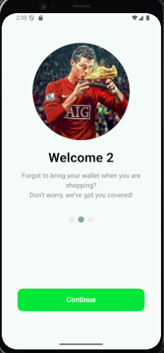

# 📱 Splash Screen Flutter

## 👤 Identitas Mahasiswa

* **Nama:** Muhammad Ilham Maulana
* **NIM:** 1123150141

---

## 🖼️ Hasil Screenshot

Tampilan halaman splash screen aplikasi:



> (Pastikan file hasil tangkapan layar kamu disimpan di folder:
> `screenshots/splash_screen_2.png`)

---

## ⚙️ Cara Menjalankan Project

1. Buka project di **Android Studio** atau **VS Code**.
2. Pastikan perangkat (emulator atau HP) sudah terhubung.
3. Jalankan perintah berikut di terminal:

   ```bash
   flutter run
   ```
4. Aplikasi akan berjalan langsung di perangkat.

---

## 🧾 Catatan

Tidak ada kendala selama pengerjaan project.

---

✨ *Ujian Flutter — Institut Teknologi & Bisnis Bina Sarana Global* ✨
